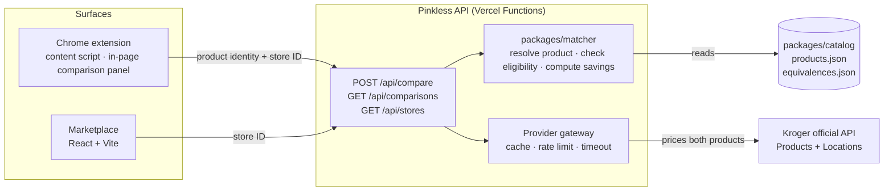

<!-- TODO: replace or supplement the logo with a banner image (optional) -->

**See the markup. Skip the markup.**

A Chrome extension and companion Marketplace that spot a women's product and show a
human-reviewed men's or neutral equivalent that costs less at the same store, with both prices
pulled from the retailer's official data.

<!-- TODO: add a license badge once a LICENSE file exists -->

Built for **HackHers**.

[Problem](#the-problem) · [What it does](#what-it-does) · [Demo](#demo) ·
[How it works](#how-it-works) · [Tech stack](#tech-stack) · [Roadmap](#roadmap) ·
[Team](#team--acknowledgments)

---

## The problem

A [NYC Department of Consumer Affairs study](https://www.nyc.gov/assets/dca/downloads/pdf/partners/Study-of-Gender-Pricing-in-NYC.pdf)
of about 800 products across five industries found that the women's version cost more 42% of the
time, 7% more on average, and up to 13% more in personal care. Take razors: Gillette Venus
Sensitive and Gillette Sensor3 Sensitive come from the same maker and both have three blades, yet
the women's version runs about 46% more per razor.
<!-- TODO: cite a source and date for the ~46% Gillette figure (it is not derived from anything in this repo) -->

Pinkless doesn't argue about _why_ a price differs. It shows you two reviewed products, two Kroger
prices, and one store, and lets you decide.

## What it does

> **Current scope:** Kroger is the only supported retailer in this release. More retailers are on
> the [roadmap](#roadmap).

**Chrome extension**

- While you shop on kroger.com, it recognizes when you're looking at a women's product that has a
  reviewed men's or neutral equivalent.
- If the equivalent costs less **at your selected Kroger store**, it shows one badge with the
  savings, what matches, what differs, the store, and the date checked.
- **See alternative** opens the equivalent's Kroger page in a new tab. **Not now** dismisses the
  badge for that page.
- You pick your Kroger store by ZIP code, and that choice stays on your device.
- When it isn't sure, it says nothing. A weak match never produces a badge.

**Marketplace**

- Pick a Kroger store, then browse every reviewed pair where the men's or neutral product costs
  less there.
- Every price shows its store and when it was checked.
- No login, checkout, or tracking.

Every pair is written and reviewed by a person, never guessed automatically.

## Demo

<!-- TODO: add a demo GIF or screenshots of the badge and the Marketplace -->
<!-- TODO: add a demo video link, if there is one -->

| Live Marketplace                                                           | Demo video | Screenshots |
| -------------------------------------------------------------------------- | ---------- | ----------- |
| [pinkless-marketplace.vercel.app](https://pinkless-marketplace.vercel.app) | _TODO_     | _TODO_      |

## How it works

1. **The extension only reports identity.** Its Kroger adapter extracts a normalized `ProductView`
   (product ID, canonical URL, title, page price, availability, selected variant). A background
   service worker sends that plus the selected store, and nothing else, to the API. The extension
   holds no credentials and does no matching.
2. **The API does the pricing.** It resolves the product against the catalog (exact UPC, then
   Kroger product ID, then canonical URL pattern), then prices the current product **and** its
   reviewed equivalents through the Kroger provider at that store. The page's own price is only a
   consistency check; a mismatch suppresses.
3. **The matcher decides.** `packages/matcher` is deterministic: no fuzzy matching, no ML. It only
   compares a women's product with an active, human-reviewed men's/neutral pair, and only when both
   offers are eligible and the savings are positive.
4. **The Marketplace is another client.** It calls `GET /api/comparisons` for the selected store
   and never touches Kroger directly. Because both surfaces go through the API, they read one
   catalog and can't drift.

Kroger credentials live only in server-side environment variables (Vercel). The extension and
Marketplace never see them.

### Silence is the default

A weak match should never produce a badge, so anything not explicitly covered by a reviewed catalog
record is left alone. Pinkless shows nothing when:

- the product isn't in the catalog, isn't marketed to women, or has no active reviewed pair;
- the pair crosses categories or sizes;
- no store is selected, or the two offers aren't from the same store and price context (including
  online vs. in-store);
- either offer is out of stock, expired, non-USD, or not a positive price;
- the page price disagrees with Kroger's price for the same product;
- Kroger credentials or the Kroger API are unavailable (no partial or invented prices);
- the men's or neutral product isn't cheaper (savings of zero or less).

Prices are Kroger's **regular** price in **integer cents**, never promo prices, never floats. Copy
states prices, store, date, and who a product is marketed to; it never says why prices differ.

## Tech stack

| Area        | What's used                                                                                        |
| ----------- | -------------------------------------------------------------------------------------------------- |
| Language    | TypeScript 5.9                                                                                     |
| Marketplace | React 19, React Router 7, Vite 7, CSS Modules                                                      |
| Extension   | Chrome Manifest V3 (content script, service worker, toolbar popup), bundled with Vite              |
| API         | Vercel Functions (`api/`), Web-standard `Request`/`Response` handlers                              |
| Data source | Kroger public API (Products and Locations), OAuth client credentials, `product.compact` scope only |
| Design      | Shared design tokens in `packages/tokens` ([DESIGN_SYSTEM.md](DESIGN_SYSTEM.md))                   |
| Testing     | Vitest 4, Testing Library, jsdom, happy-dom                                                        |
| Tooling     | pnpm workspaces, Prettier, GitHub Actions                                                          |

## Roadmap

Everything here is future work; none of it is in the current build.

- [ ] **Public launch.** Make the Marketplace and extension available to everyone.
- [ ] **More reviewed pairs and categories.** Razors, deodorant, and shave care are covered so far.
      Body wash and more are next, once each pair has been reviewed by a person.
- [ ] **Savings tracker.** See how much you've saved over time.
- [ ] **Community submissions.** Suggest a pair for review. Nothing would publish without a
      person's sign-off.
- [ ] **Other retailers.** Added once each has approved data access.

## Team & acknowledgments

Built at **HackHers**.

- [@pooravrawat1](https://github.com/pooravrawat1)
- [@jsberesford](https://github.com/jsberesford)
- [@natashanarine](https://github.com/natashanarine)
- [@edamai-13](https://github.com/edamai-13)

Research: the NYC Department of Consumer Affairs gender-pricing study linked above. Prices come from
Kroger's public developer API.

## License

<!-- TODO: no LICENSE file exists in the repo. Choose a license, add LICENSE, then update this section and add a badge. -->

_No license file yet._
